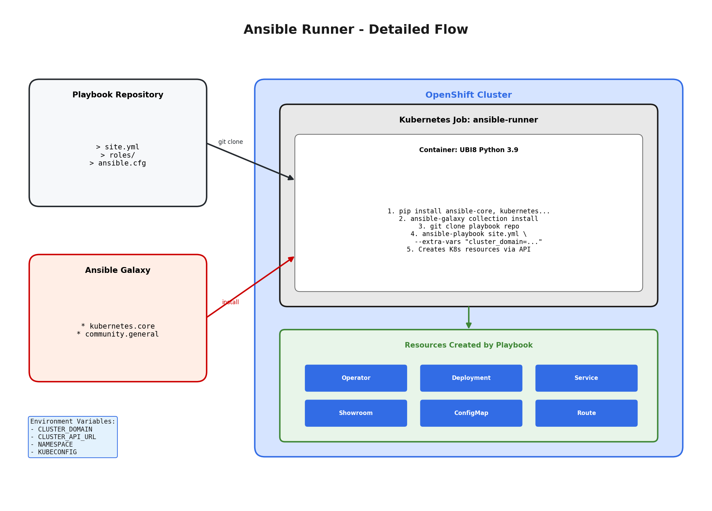

# Ansible Developer Guide for Field Content

This guide explains how to use Ansible to automate your field content deployment. If you're comfortable with Ansible and want to use it for your demo/lab automation, this is the approach for you.

## How It Works

When you deploy field content using Ansible:

1. **You provide a Git repository** containing your Ansible playbooks
2. **ArgoCD creates a Kubernetes Job** that runs your playbook inside the cluster
3. **Your playbook creates resources** (Deployments, Services, Routes, etc.) using the `kubernetes.core.k8s` module
4. **Cluster information is automatically provided** as variables (`cluster_domain`, `cluster_api_url`, `namespace`)



## Quick Start

### 1. Create Your Playbook Repository

Create a Git repository with this structure:

```
my-ansible-demo/
├── site.yml              # Your main playbook
├── requirements.yml      # Optional: Ansible collections/roles to install
└── requirements.txt      # Optional: Python packages to install
```

### 2. Write Your Playbook

Here's a minimal example:

```yaml
# site.yml
---
- name: Deploy My Demo
  hosts: localhost
  connection: local
  gather_facts: true

  tasks:
  - name: Create a Deployment
    kubernetes.core.k8s:
      state: present
      definition:
        apiVersion: apps/v1
        kind: Deployment
        metadata:
          name: my-app
          namespace: "{{ namespace }}"
        spec:
          replicas: 1
          selector:
            matchLabels:
              app: my-app
          template:
            metadata:
              labels:
                app: my-app
            spec:
              containers:
              - name: app
                image: registry.redhat.io/ubi8/httpd-24:latest
                ports:
                - containerPort: 8080

  - name: Create userinfo ConfigMap for RHDP
    kubernetes.core.k8s:
      state: present
      definition:
        apiVersion: v1
        kind: ConfigMap
        metadata:
          name: my-demo-userinfo
          namespace: "{{ namespace }}"
          labels:
            demo.redhat.com/userinfo: ""  # Required for RHDP integration
        data:
          demo_title: "My Ansible Demo"
          demo_url: "https://my-app.{{ cluster_domain }}"
```

### 3. Variables Available to Your Playbook

These variables are automatically provided:

| Variable | Description | Example |
|----------|-------------|---------|
| `cluster_domain` | The apps domain for routes | `apps.cluster-abc.example.com` |
| `cluster_api_url` | The Kubernetes API URL | `https://api.cluster-abc.example.com:6443` |
| `namespace` | The namespace for your resources | `field-content-demo` |

Use them in your playbook like:
```yaml
- name: Create a Route
  kubernetes.core.k8s:
    definition:
      apiVersion: route.openshift.io/v1
      kind: Route
      metadata:
        name: my-app
        namespace: "{{ namespace }}"
      spec:
        host: "my-app.{{ cluster_domain }}"
        to:
          kind: Service
          name: my-app
```

## Using External Collections and Roles

### Ansible Collections

Specify collections in your `requirements.yml`:

```yaml
# requirements.yml
collections:
  - name: kubernetes.core
    version: ">=2.3.0"
  - name: community.general
  - name: redhat.openshift
```

Or in the Helm values when deploying:

```yaml
ansible-runner:
  ansible:
    collections:
      - kubernetes.core:==3.2.0
      - community.general:==9.5.0
```

### Ansible Roles

Include roles in `requirements.yml`:

```yaml
# requirements.yml
roles:
  - name: geerlingguy.docker
    version: "6.0.0"
  - src: https://github.com/your-org/your-role.git
    name: my-custom-role
```

### Python Packages

If your playbook needs additional Python packages, create a `requirements.txt`:

```
# requirements.txt
jmespath        # For json_query filter
boto3           # For AWS modules
requests        # For uri module
```

## RHDP Integration

To pass information back to the Red Hat Demo Platform, create a ConfigMap with the `demo.redhat.com/userinfo` label:

```yaml
- name: Create userinfo ConfigMap
  kubernetes.core.k8s:
    state: present
    definition:
      apiVersion: v1
      kind: ConfigMap
      metadata:
        name: "{{ app_name }}-userinfo"
        namespace: "{{ namespace }}"
        labels:
          demo.redhat.com/userinfo: ""  # This label is required!
      data:
        demo_title: "My Demo Title"
        demo_url: "https://my-app.{{ cluster_domain }}"
        access_instructions: "Click the URL above to access your demo"
        # Add any other info you want to show the user
```

## Common Patterns

### Creating Multiple Resources

```yaml
- name: Deploy complete application stack
  kubernetes.core.k8s:
    state: present
    definition: "{{ item }}"
  loop:
    - apiVersion: v1
      kind: ConfigMap
      metadata:
        name: app-config
        namespace: "{{ namespace }}"
      data:
        setting: "value"

    - apiVersion: apps/v1
      kind: Deployment
      metadata:
        name: app
        namespace: "{{ namespace }}"
      spec:
        # ... deployment spec

    - apiVersion: v1
      kind: Service
      metadata:
        name: app
        namespace: "{{ namespace }}"
      spec:
        # ... service spec
```

### Waiting for Resources

```yaml
- name: Wait for deployment to be ready
  kubernetes.core.k8s_info:
    api_version: apps/v1
    kind: Deployment
    name: my-app
    namespace: "{{ namespace }}"
  register: deployment
  until: deployment.resources[0].status.readyReplicas | default(0) >= 1
  retries: 30
  delay: 10
```

### Installing an Operator

```yaml
- name: Create OperatorGroup
  kubernetes.core.k8s:
    state: present
    definition:
      apiVersion: operators.coreos.com/v1
      kind: OperatorGroup
      metadata:
        name: my-operator-group
        namespace: "{{ namespace }}"
      spec:
        targetNamespaces:
          - "{{ namespace }}"

- name: Create Subscription
  kubernetes.core.k8s:
    state: present
    definition:
      apiVersion: operators.coreos.com/v1alpha1
      kind: Subscription
      metadata:
        name: my-operator
        namespace: "{{ namespace }}"
      spec:
        channel: stable
        name: my-operator
        source: redhat-operators
        sourceNamespace: openshift-marketplace
```

## Debugging Your Playbook

If your playbook fails, check the Job logs:

```bash
# Find the job
oc get jobs -n <namespace>

# View logs
oc logs job/<job-name> -n <namespace>

# Or follow logs in real-time
oc logs -f job/<job-name> -n <namespace>
```

## Best Practices

1. **Make playbooks idempotent** - They should be safe to run multiple times
2. **Use `state: present`** - Let Kubernetes handle create vs update
3. **Always create the userinfo ConfigMap** - This integrates with RHDP
4. **Pin collection versions** - For reproducible builds
5. **Keep playbooks focused** - One main purpose per playbook
6. **Log important information** - Use `debug` tasks for troubleshooting

## Example Repository Structure

For a complete demo, your repository might look like:

```
my-demo/
├── site.yml                    # Main entry point
├── requirements.yml            # Collections and roles
├── requirements.txt            # Python packages (if needed)
├── group_vars/
│   └── all.yml                # Default variables
├── roles/
│   └── my-app/                # Custom role for your app
│       ├── tasks/
│       │   └── main.yml
│       └── templates/
│           └── configmap.yaml.j2
└── README.md                   # Documentation for your demo
```

## Getting Help

- Check the [kubernetes.core collection docs](https://docs.ansible.com/ansible/latest/collections/kubernetes/core/)
- Review the example in `examples/ansible/`
- Look at the test playbook in `tests/ansible-test/site.yml`
